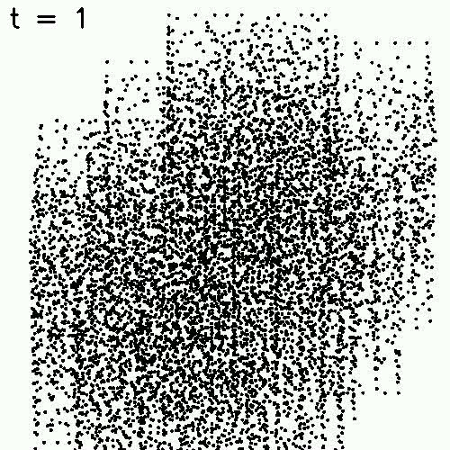
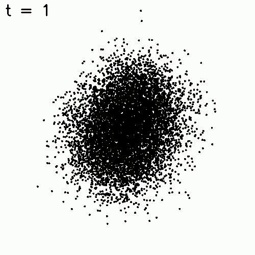
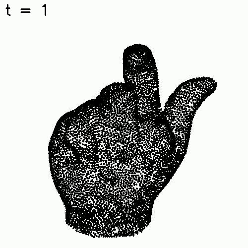

# PUFM
Efficient Point cloud Upsampling via Flow matching

 [arXiv](https://arxiv.org/abs/2501.15286)

This is the official PyTorch implementation of our paper "Efficient Point cloud Upsampling via Flow matching".


## Abstract

Diffusion models are a powerful framework for tackling ill-posed problems, with recent advancements extending their use to point cloud upsampling. Despite their potential, existing diffusion models struggle with inefficiencies as they map Gaussian noise to real point clouds, overlooking the geometric information inherent in sparse point clouds. To address these inefficiencies, we propose PUFM, a flow matching approach to directly map sparse point clouds to their high-fidelity dense counterparts. Our method first employs midpoint interpolation to sparse point clouds, resolving the density mismatch between sparse and dense point clouds. Since point clouds are unordered representations, we introduce a pre-alignment method based on Earth Mover's Distance (EMD) optimization to ensure coherent interpolation between sparse and dense point clouds, which enables a more stable learning path in flow matching. Experiments on synthetic datasets demonstrate that our method delivers superior upsampling quality but with fewer sampling steps. Further experiments on ScanNet and KITTI also show that our approach generalizes well on RGB-D point clouds and LiDAR point clouds, making it more practical for real-world applications.

|  |  |  |
|----------------------|----------------------|----------------------|
| DDPM              | PUDM             | Ours              |


## Installation

* Install the following packages

```
python==3.9
torch==1.13
numpy==1.25.2
open3d==0.17.0
einops==0.3.2
scikit-learn==1.3.1
tqdm==4.62.3
h5py==3.6.0
```

* Install the built-in libraries

```
cd models/pointops
python setup.py install
cd ../../Chamfer3D
python setup.py install
cd ../emd_assignment
python setup.py install
```

## Data Preparation
Please download [ [PU1K](https://github.com/guochengqian/PU-GCN) ] and [ [PUGAN](https://github.com/liruihui/PU-GAN) ].
```
# For generating test data, please see **dataset/prepare_data.py**
cd dataset

# We can generate 4x test set of PUGAN:
python prepare_data.py --input_pts_num 2048 --R 4 --mesh_dir mesh_dir --save_dir save_dir
```

For more information, please refer to [ [Grad-PU](https://github.com/yunhe20/Grad-PU) ]

## Quick Start
We have provided the pretarined models in the `pretrained_model` folder, so you can directly use them to reproduce the results.

* PU-GAN
```
# 4X on one single point cloud
python test_pufm.py --model pufm --test_input_path example/camel.xyz --up_rate 4
# 11X, upsampled point clouds
python test_pufm_arbitrary.py --model pufm_w_attn --dataset pugan --test_input_path /data/PU-GAN/input_2048_4X/input_2048/ --up_rate 11
# 4X on PUGAN evaluation, upsampled point clouds using PUFM
python eval_pufm.py --model pufm --dataset pugan --test_input_path /data/PU-GAN/input_2048_4X/input_2048/ --up_rate 4
# 4X on PUGAN evaluation, upsampled point clouds using PUFM_w_attn
python eval_pufm.py --model pufm_w_attn --dataset pugan --test_input_path /data/PU-GAN/input_2048_4X/input_2048/ --up_rate 4
# 16X on PUGAN evaluation, upsampled point clouds
python eval_pufm.py --model pufm_w_attn --dataset pugan --test_input_path /data/PU-GAN/input_2048_4X/input_2048/ --up_rate 16
```

## Training

If you want to train our model yourself, you can try the following commands.

* PU1K

```
python train_pufm.py
```

## Acknowledgments

Our code is built upon the following repositories: [PU-GCN](https://github.com/guochengqian/PU-GCN), [PU-GAN](https://github.com/liruihui/PU-GAN) and [Grad-PU]([https://github.com/CVMI-Lab/PAConv](https://github.com/yunhe20/Grad-PU)). Thanks for their great work.

## Citation

If you find our project is useful, please consider citing us:

```
@InProceedings{ZSLiu_2025,
    author    = {Zhi-Song Liu and Chenhang He and Lei Li},
    title     = {Efficient Point Clouds Upsampling via Flow Matching},
    booktitle = {arXiv:2501.15286},
    year      = {2025}
}
```
